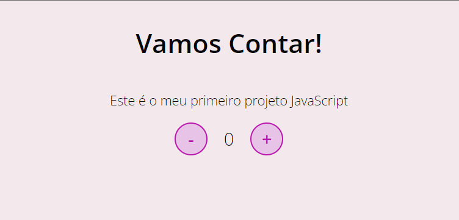

## Primeiro projeto JavaScript criado no curso da Dio Decola Tech 6/2022.
#

 Aprendi a criar um contador utilizando o HTML, CSS e JavaScript

 

 

 
### Grazi Armond 😊
          
          
          